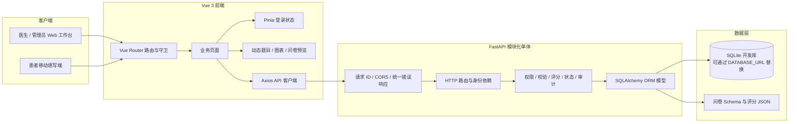
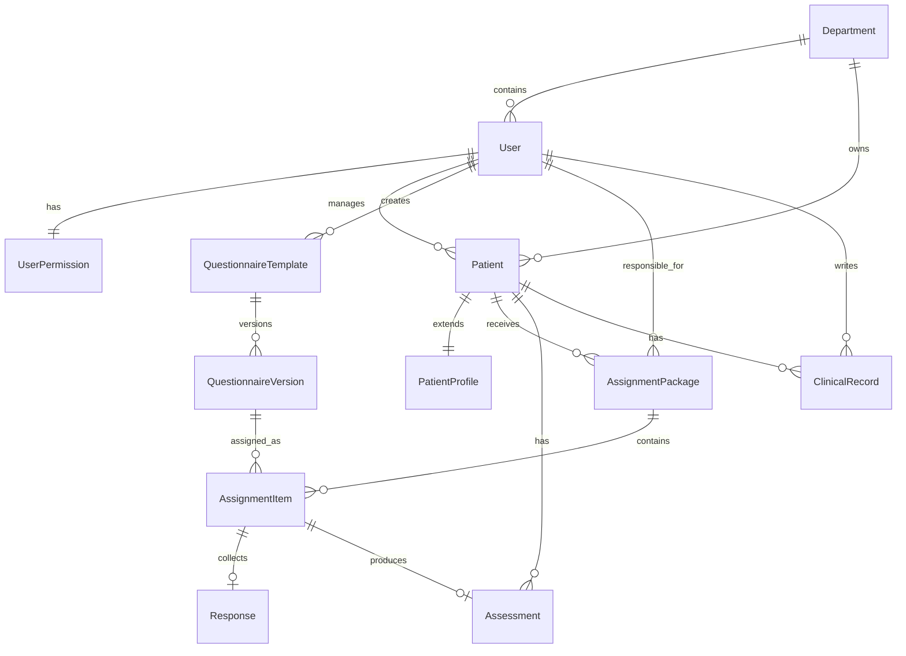

# 阿尔茨海默症筛查问卷与数据统计系统

## 项目架构、技术选型、设计设想与功能实现说明

> 文档基线：2026-09-02，分支 `yjj`，代码版本 `bbfabb7`  
> 项目性质：软件工程课程展示系统 / 非临床演示系统  
> 说明：本文以当前实际接入运行入口的代码为准，并明确区分“已经实现”“已有基础但仍需完善”和“未来设想”。

---

## 1. 项目概述

本项目是一个面向认知筛查场景的前后端分离 Web 系统。系统连接医生、患者和管理员三个角色，解决传统纸质问卷或零散电子表格中常见的几个问题：

1. 医生难以统一管理患者、问卷派发和填写进度；
2. 患者需要一个适合手机访问、无需注册复杂账号的填写入口；
3. 问卷题目、版本、评分规则容易与页面代码耦合，后续增删困难；
4. 填写结果、风险提示、纵向变化和临床记录分散，无法形成连续档案；
5. 医生之间需要数据隔离，管理员需要集中管理科室、账号、权限和审计记录。

围绕这些问题，项目已经形成如下真实业务闭环：

```text
医生登录
  -> 创建或维护患者档案
  -> 选择已发布问卷并派发
  -> 生成患者链接、二维码和六位访问码
  -> 患者在手机端验证身份并填写
  -> 系统自动保存草稿
  -> 患者提交问卷
  -> 后端统一校验和评分
  -> 生成评估结果与风险提示
  -> 医生查看答案、趋势和诊疗记录
  -> 统计看板与 CSV 数据同步更新
```

本系统自带的患者、诊疗记录和题目均为虚构演示数据。自动评分只能形成风险提示，不能替代正式医学量表、授权评分手册、医生面诊或临床诊断。

---

## 2. 产品设想

### 2.1 核心设想

项目的核心设想不是只做一个“填问卷页面”，而是建设一个可持续扩展的认知筛查工作流平台。平台以患者为中心，以问卷任务为入口，以评估结果和纵向档案为输出。

其主要设计目标如下：

- **形成完整闭环**：覆盖创建患者、派发、填写、自动保存、提交、计分、查看和统计，而不是只展示静态页面。
- **问卷配置化**：题目、选项、必填状态、条件显示、维度、分值和风险阈值尽量存储为 JSON 配置，减少新增问卷时对前后端页面代码的修改。
- **版本可追溯**：派发任务绑定具体问卷版本，后续新建版本不应改变历史任务的题目和评分依据。
- **患者低门槛使用**：患者通过专属链接或二维码进入，再用独立访问码验证，不要求患者维护传统账号和密码。
- **连续照护视角**：不仅保存单次问卷结果，还围绕患者展示最新量表、历次趋势、风险分布和临床记录。
- **权限真正落在后端**：前端隐藏按钮只改善交互，最终授权由后端执行，避免仅靠页面控制造成越权。
- **适合演示，也为升级留边界**：当前使用 SQLite 和模块化单体降低部署复杂度，同时保留切换 PostgreSQL、正式身份认证、合规审计和专业量表计算器的空间。

### 2.2 三类用户设想

| 角色 | 使用目标 | 当前主要能力 |
|---|---|---|
| 医生 | 管理本人负责的患者与筛查任务 | 患者档案、问卷派发、进度跟踪、结果查看、趋势分析、诊疗记录 |
| 患者 | 低门槛完成医生派发的问卷 | 链接与访问码验证、移动端填写、草稿恢复、提交、任务完成提示 |
| 管理员 | 管理组织、账号、权限和全局业务 | 科室管理、账号管理、细粒度授权、任务转交、问卷管理、审计查看、全局统计 |

### 2.3 设计边界

当前系统定位为“非临床课程演示”，因此有意设置以下边界：

- 不宣称自动评分等同于疾病诊断；
- 不应录入真实身份证、真实敏感病历等生产数据；
- 对涉及版权或专业操作材料的量表，系统只保存结构化结果录入字段，不复制受保护的原始图形材料；
- 正式上线前必须重新评估量表授权、隐私合规、数据加密、身份认证、备份恢复和日志留存策略。

---

## 3. 总体架构

### 3.1 架构形态

当前项目采用：

**前后端分离 + 模块化单体 + 分层架构 + 元数据驱动问卷引擎**。

它不是微服务架构。所有后端能力运行在同一个 FastAPI 应用和同一个数据库中，但认证、患者、问卷、派发、评分、统计、权限和审计等职责通过路由层、服务层和数据模型进行拆分。这种形式适合当前课程项目规模：部署简单、调试直接，同时比把所有逻辑堆在一个文件中更容易维护。



### 3.2 分层职责

| 层次 | 主要目录 | 职责 |
|---|---|---|
| 表现层 | `frontend/src/views`、`frontend/src/components` | 页面展示、表单交互、图表、二维码、动态题目渲染 |
| 前端应用层 | `frontend/src/router.ts`、`stores`、`api`、`utils` | 路由控制、登录状态、统一请求、幂等键与患者显示工具 |
| HTTP 接口层 | `backend/app/routers` | 接收参数、注入身份和数据库会话、返回 HTTP 响应 |
| 业务服务层 | `backend/app/services` | 权限判断、问卷校验、评分、任务状态刷新、审计记录 |
| 领域与持久化层 | `backend/app/models.py` | 定义患者、问卷、任务、回答、评估和审计之间的数据关系 |
| 基础设施层 | `backend/app/core` | 配置、数据库连接、JWT、安全散列、依赖和统一异常 |
| 初始化与运维 | `backend/app/seed.py`、`scripts` | 演示数据、安装、启动、停止和自动化检查 |

### 3.3 当前运行入口与历史目录说明

当前 FastAPI 运行入口是 `backend/app/main.py`。它实际注册的是：

- `backend/app/routers/auth.py`
- `backend/app/routers/patients.py`
- `backend/app/routers/questionnaires.py`
- `backend/app/routers/assignments.py`
- `backend/app/routers/patient_session.py`
- `backend/app/routers/statistics.py`
- `backend/app/routers/admin.py`

仓库内还存在 `backend/app/modules` 目录，其中包含一套较早的按领域组织的模型、路由和服务草稿；但这些路由没有在当前 `main.py` 中注册，不属于当前运行时 API。阅读、维护或继续开发时，应以 `routers + services + models.py` 这条主链为准。后续可以选择逐步迁移到完全按领域分包的结构，但不应让两套实现长期并行演进。

---

## 4. 使用的技术与作用

### 4.1 前端技术栈

| 技术 | 当前版本 | 在项目中的作用 |
|---|---:|---|
| Vue | 3.5.21 | 使用组合式 API 构建医生端、管理员端和患者端页面 |
| TypeScript | 5.9.2 | 为页面状态、接口数据和组件参数提供静态类型检查 |
| Vite | 7.1.3 | 前端开发服务器、模块热更新和生产构建 |
| Vue Router | 4.5.1 | 页面路由、公开页面标记、登录守卫和管理员页面限制 |
| Pinia | 3.0.3 | 保存当前医务人员登录状态与权限信息 |
| Axios | 1.11.0 | 统一访问 `/api/v1`，自动附加医务端或患者端 Bearer Token |
| Element Plus | 2.11.1 | 表格、表单、对话框、标签、日期选择和消息提示等界面组件 |
| ECharts | 6.0.0 | 总览、风险分布、问卷完成率和患者纵向趋势图表 |
| qrcode | 1.5.4 | 将患者专属填写链接生成二维码 |

前端采用按职责拆分的单页应用结构：

- `views` 对应完整业务页面；
- `components` 放置可复用的动态题目、统计卡片、图表和问卷详情预览；
- `api/client.ts` 统一处理请求地址、Token 和错误消息；
- `stores/auth.ts` 管理工作人员会话；
- `router.ts` 对公开患者页面、登录页面、普通工作台和管理员页面进行分流。

### 4.2 后端技术栈

| 技术 | 当前版本 | 在项目中的作用 |
|---|---:|---|
| Python | 3.12（项目运行要求） | 后端业务实现语言 |
| FastAPI | 0.124.4 | REST API、依赖注入、接口文档和参数校验入口 |
| Uvicorn | 0.38.0 | ASGI 开发服务器 |
| Pydantic | 2.12.5 | 请求体字段、长度、枚举模式和数据类型校验 |
| SQLAlchemy | 2.0.43 | ORM、关系映射、查询和事务管理 |
| PyJWT | 2.10.1 | 医务人员 Token 与患者临时会话 Token |
| PBKDF2-HMAC-SHA256 | Python 标准库实现 | 工作人员密码和患者访问码的加盐散列存储 |
| pytest | 8.4.1 | 后端接口闭环和权限行为自动化测试 |
| httpx / TestClient | 0.28.1 | 在测试中模拟真实 HTTP 请求 |

### 4.3 数据存储

开发环境使用 SQLite。由于当前 Windows 中文工作目录可能导致 SQLite 打开数据库失败，默认数据库位于：

```text
%TEMP%\ad_questionnaire_data\ad_questionnaire.db
```

数据库地址由 `DATABASE_URL` 环境变量覆盖，因此后续可切换到 ASCII 路径下的 SQLite 或 PostgreSQL。需要注意：目前项目依赖 `Base.metadata.create_all()` 自动建表，没有正式数据库迁移工具；生产化时建议增加 Alembic。

问卷题目和评分规则分别保存在 `schema_json` 与 `scoring_json` 字段中。这种 JSON 元数据方案允许一套动态组件渲染多个问卷，也能让历史版本保留自己的题目与评分配置。

---

## 5. 关键架构设计

### 5.1 模块化单体

认证、患者、问卷、派发、患者会话、统计和管理能力虽然部署在同一个进程中，但 API 路由按业务拆分。跨模块规则下沉到服务层，减少页面和路由中的重复逻辑。

这种架构的优点是：

- 本地只需启动一个后端和一个前端；
- 业务调用不需要分布式事务和服务发现；
- 模块边界清楚，未来数据量或团队规模扩大后，可按边界拆分服务；
- 更适合课程演示和中小规模内部系统。

### 5.2 元数据驱动问卷架构

问卷不是写死在 Vue 页面中的。一个问卷版本包含：

- 问卷标题和提示；
- 多个分区 `sections`；
- 每个分区下的题目 `questions`；
- 题目唯一键 `key`；
- 题型 `type`；
- 标签、帮助文字和必填状态；
- 选项、选项分值、最小值和最大值；
- 所属评分维度；
- `show_if` 条件显示规则；
- 评分策略与风险阈值。

当前支持的题型有：

```text
short_text / long_text / integer / number / date / time / duration
yes_no / single_choice / multi_choice / scale
```

患者端通过 `DynamicQuestion.vue` 根据类型渲染真实输入控件；问卷库通过 `QuestionnaireDetailDialog.vue` 以只读方式预览具体题目、选项、范围、条件、来源、维度和风险阈值。

### 5.3 问卷版本架构

数据模型将“问卷模板”和“问卷版本”分开：

- `QuestionnaireTemplate` 保存稳定的编码、名称、说明和发布状态；
- `QuestionnaireVersion` 保存版本号、题目 Schema、评分规则和发布时间；
- `AssignmentItem` 绑定具体的 `questionnaire_version_id`。

因此派发任务创建后，即使管理员导入同编码问卷的新版本，旧任务仍可按照原版本展示和计分，避免历史数据语义漂移。

当前实现允许创建模板、导入目录量表、导入 JSON 包和发布模板；新版本通过再次导入同编码问卷生成。更严格的“已发布版本完全不可修改”主要依靠当前 API 没有提供直接编辑历史版本接口来保证，后续仍可增加数据库约束和版本状态机。

### 5.4 RBAC 与能力权限组合

系统采用两层授权：

1. **角色层**：`admin` 和 `doctor`；
2. **能力层**：为每个用户保存四个权限开关。

四项能力权限为：

- 创建患者；
- 派发和修改问卷任务；
- 查看结果并维护诊疗记录；
- 管理问卷模板。

管理员默认拥有全部能力，并可以配置医生权限。医生只能访问分配给自己的患者和任务。后端通过身份依赖、`ensure_patient_scope` 和 `require_permission` 执行真实拦截，因此即使绕过前端按钮直接调用 API，越权请求仍会返回 403。

### 5.5 双会话认证架构

系统区分两类会话：

- **工作人员会话**：账号密码登录后获得带角色声明的 JWT，前端保存在 `localStorage`；
- **患者临时会话**：患者同时提交派发 Token 和六位访问码，通过后获得带 `assignment_id` 的短期 JWT，前端保存在 `sessionStorage`。

派发原始 Token 不明文保存到数据库，而是保存 SHA-256 摘要；访问码使用与密码一致的 PBKDF2 加盐散列保存。患者链接和访问码只在创建任务时返回给操作者。

这种设计比仅凭链接直接打开问卷多一道验证，并让患者会话只能访问对应派发包内的任务。

### 5.6 草稿并发与幂等提交

患者填写过程使用两个可靠性机制：

- **乐观并发控制**：草稿带 `revision` 版本号。服务端只接受与当前版本一致的保存，避免旧页面覆盖新草稿；
- **幂等提交**：最终提交携带 `Idempotency-Key`。相同请求因网络重试重复到达时，服务端返回已有结果，不重复创建评估记录。

这两项机制分别解决“多次保存覆盖”和“重复点击/弱网络重试导致重复提交”的问题。

### 5.7 状态机设计

派发包和其中每份问卷都有独立状态。

派发包常见状态：

```text
pending -> in_progress -> submitted -> reviewed
    |           |
    +--------> expired
    +--------> revoked
```

问卷任务常见状态：

```text
not_started -> draft -> submitted -> reviewed
```

后端根据子任务状态刷新派发包状态，并在验证和访问任务时检查截止时间与撤销状态。已提交、已复核或已撤销任务受到修改限制。

### 5.8 统一评分服务

提交时，后端先执行问卷答案校验，再调用评分服务：

1. 过滤因条件规则而不可见的题目；
2. 读取选项分值或允许计分的数字字段；
3. 汇总各题分数；
4. 按题目维度累计 `dimension_scores`；
5. 根据风险阈值计算 `low / medium / high / unknown`；
6. 生成 `Assessment` 记录。

当前实现支持两类策略：

- `metadata_sum`：按元数据自动求和并判断风险；
- `manual_review`：不自动计算总分，结果标记为待人工复核。

复杂专业量表后续应新增独立、命名明确、带版本和单元测试的计算器，而不是继续把全部规则堆叠到通用求和函数中。

### 5.9 审计与可追踪性

系统会为登录、患者操作、任务派发或修改、患者验证、结果查看、导出、临床记录和管理员配置等关键动作写入 `AuditLog`。

每个 HTTP 请求还会获得一个 `X-Request-ID`：调用方可以传入，也可以由中间件生成；该编号会写回响应，并出现在统一错误响应中，便于定位一次失败请求。

---

## 6. 数据模型与关系

### 6.1 核心实体

| 实体 | 作用 | 关键关系 |
|---|---|---|
| `Department` | 科室和数据组织单位 | 关联用户与患者 |
| `User` | 医生或管理员账号 | 属于科室，可负责患者和任务 |
| `UserPermission` | 用户能力权限 | 与用户一对一 |
| `Patient` | 患者业务主档 | 关联科室、主诊医生和扩展资料 |
| `PatientProfile` | 患者详细资料 | 与患者一对一 |
| `QuestionnaireTemplate` | 问卷稳定标识与发布状态 | 拥有多个版本 |
| `QuestionnaireVersion` | 某版题目和评分规则 | 被具体派发任务引用 |
| `AssignmentPackage` | 一次派发任务包 | 对应患者、负责医生和若干问卷 |
| `AssignmentItem` | 派发包内的一份问卷 | 对应问卷版本与一份回答 |
| `Response` | 患者答案与草稿状态 | 保存答案 JSON、修订号和幂等键 |
| `Assessment` | 提交后形成的评估 | 保存总分、维度分、风险和复核状态 |
| `ClinicalRecord` | 医生诊断、随访、治疗或备注 | 属于患者并记录作者 |
| `AuditLog` | 关键业务操作轨迹 | 保存操作者、动作、对象和时间 |

### 6.2 关系概览



---

## 7. 已实现功能

### 7.1 登录与身份

- 医生和管理员账号密码登录；
- JWT 登录态；
- 获取当前用户、角色、科室和能力权限；
- 前端未登录路由拦截；
- 管理员页面角色拦截；
- 停用账号无法登录；
- 登录动作写入审计日志。

### 7.2 患者管理

- 分页查看患者列表；
- 按患者编号或姓名搜索；
- 医生只查看本人负责患者，管理员可查看全局；
- 新建患者；
- 编辑姓名、性别、出生日期、教育程度和居住类型；
- 编辑联系电话、婚姻、职业、紧急联系人；
- 编辑主诉、既往史、家族史、当前用药和过敏史；
- 根据出生日期计算年龄；
- 查看最新量表快照、全部评估趋势和风险分布；
- 管理诊断、随访、治疗和备注四类临床记录；
- 管理员可归档患者；
- 跨医生患者访问由后端拦截。

### 7.3 问卷模板与版本

- 查看问卷模板列表；
- 查看具体问卷题目、选项、题型、必填状态和评分信息；
- 创建 JSON 驱动的问卷模板；
- 校验问卷至少包含一个分区、题目键不重复、题型受支持；
- 发布问卷；
- 只有已发布版本可以派发；
- 从 JSON 包导入问卷；
- 从内置量表目录批量导入；
- 相同编码再次导入时创建新版本；
- 通过统一动态组件支持多种题型和条件显示。

内置可导入目录当前包含：

- 主观认知下降自测表（SCD-Q9）；
- 简明精神状态检查（MMSE）分域录入版；
- 功能活动问卷（FAQ）；
- 蒙特利尔认知评估基础版（MoCA-B）结果录入版；
- 临床痴呆评定量表（CDR）分域录入版；
- ADAS-Cog 结果录入版。

这些目录项目用于系统结构和录入流程演示。正式使用前仍需确认内容授权、专业版本、施测方法和评分规则。

### 7.4 问卷派发

- 选择一名患者；
- 一次选择一份或多份已发布问卷；
- 设置任务标题、说明和截止时间；
- 管理员可以指定负责医生；
- 自动生成随机派发 Token；
- 自动生成六位访问码；
- 生成可复制的患者链接；
- 前端将链接生成二维码；
- 查看每份问卷的填写进度；
- 修改未完成任务的标题、说明和截止时间；
- 管理员可以把未完成任务转交给其他医生；
- 撤销未提交任务；
- 阻止修改已完成或已撤销任务。

### 7.5 患者移动端填写

- 通过专属链接进入公开患者路由；
- 输入访问码完成二次验证；
- 获取任务包、患者编号、负责医生和问卷列表；
- 按问卷 Schema 动态渲染题目；
- 支持必填、数值范围、选项合法性和条件显示；
- 自动保存草稿；
- 刷新页面后恢复草稿；
- 使用修订号避免旧草稿覆盖新草稿；
- 支持继续填写；
- 使用幂等键提交，避免重复产生结果；
- 提交后展示完成状态；
- 所有问卷完成后展示任务完成提示；
- 对过期和已撤销任务返回明确状态。

### 7.6 评分与结果查看

- 提交前由后端重新校验答案，而不是只依赖前端；
- 按元数据自动累计题目分数；
- 按维度汇总分数；
- 按阈值生成低、中、高或未知风险提示；
- 自动生成评估记录；
- 医生查看患者逐题原始答案和可读选项文字；
- 查看问卷版本、提交时间、填写时长、总分、维度分和风险；
- 结果页面明确提示“筛查不等同于医学诊断”。

### 7.7 数据总览与统计

- 患者总数；
- 派发任务总数；
- 评估总数；
- 高风险患者数与比例；
- 待复核数量；
- 派发状态漏斗与完成率；
- 各问卷派发数、提交数和完成率；
- 风险等级分布；
- 按问卷统计平均分、最低分、最高分和中高风险数量；
- 医生统计仅包含本人数据，管理员统计包含全局数据；
- 导出当前权限范围内的评估 CSV；
- 前端图表支持导出 PNG。

### 7.8 管理与治理

- 新建、编辑和启停科室；
- 新建医务人员账号；
- 修改姓名、角色、科室、状态和密码；
- 防止管理员停用当前登录账号；
- 为医生配置四项业务权限；
- 后端执行权限校验；
- 查看关键操作审计轨迹。

### 7.9 演示与运维

- 初始化时自动建表并写入演示数据；
- 内置三个演示科室、管理员、六名医生和一百名虚构患者；
- 内置两份已发布的非临床演示问卷；
- 内置患者移动端演示任务和诊疗记录；
- `scripts/setup.ps1` 安装依赖；
- `scripts/start.ps1` 启动后端 8000 端口和前端 5173 端口；
- 启动脚本检测局域网 IPv4，为手机二维码生成可访问地址；
- 启动脚本检查后端 `/health` 和前端首页；
- `scripts/stop.ps1` 停止项目进程；
- FastAPI 自动提供 Swagger 接口文档。

---

## 8. 主要 API 能力

所有业务 API 使用 `/api/v1` 前缀。

| 领域 | 代表接口 | 功能 |
|---|---|---|
| 认证 | `POST /auth/login`、`GET /auth/me` | 登录与当前身份 |
| 患者 | `GET/POST /patients` | 查询与创建患者 |
| 患者详情 | `GET/PATCH /patients/{id}` | 详情与资料更新 |
| 纵向分析 | `GET /patients/{id}/analysis` | 风险、快照和趋势 |
| 临床记录 | `/patients/{id}/clinical-records` | 查询、新建和修改记录 |
| 问卷 | `GET/POST /questionnaires` | 列表与创建 |
| 问卷导入 | `/questionnaires/catalog`、`/import-catalog`、`/import-package` | 目录与 JSON 包导入 |
| 发布 | `POST /questionnaires/{id}/publish` | 发布问卷 |
| 派发 | `GET/POST /assignments` | 查询与创建任务 |
| 任务管理 | `PATCH /assignments/{id}`、`POST /{id}/revoke` | 修改、转交与撤销 |
| 结果 | `GET /assignments/{id}/items/{item_id}/result` | 查看逐题答案与评估 |
| 患者验证 | `POST /patient-session/verify` | 链接与访问码验证 |
| 患者任务 | `GET /patient-session/tasks` | 获取任务包 |
| 草稿 | `PUT /patient-session/tasks/{id}/draft` | 保存草稿和修订号 |
| 提交 | `POST /patient-session/tasks/{id}/submit` | 幂等提交与评分 |
| 统计 | `/statistics/*` | 总览、漏斗、问卷、风险和分数统计 |
| 导出 | `GET /exports/assessments.csv` | 导出权限范围内的评估 |
| 管理 | `/admin/departments`、`/admin/users`、`/admin/audit` | 组织、账号、权限和审计 |

---

## 9. 质量保证与本次验证

### 9.1 后端自动化测试覆盖

当前 `backend/tests/test_flow.py` 包含 7 个接口测试。本次在 2026-09-02 实际执行结果为：

```text
7 passed in 5.61s
```

覆盖内容包括：

1. 医生登录、患者创建、问卷派发、患者验证、草稿保存、提交、计分和统计更新；
2. 相同幂等键重复提交不会产生重复评估；
3. 医生无法读取其他医生负责的患者；
4. 演示患者链接可以验证并取得两份任务；
5. 管理员配置医生权限后，后端会立即允许或拒绝相应操作；
6. 患者完整档案、临床记录和纵向分析接口；
7. 管理员转交未完成任务、归档患者，以及目录量表导入与新版本创建。

### 9.2 前端构建验证

本次执行了 TypeScript 检查和 Vite 生产构建。默认 `frontend/dist` 在清理旧 `assets` 目录时受到 Windows `EPERM` 权限或占用问题影响；改用独立输出目录后构建成功：

```text
2165 modules transformed
build completed successfully
```

构建同时给出两个较大的 JavaScript 分块警告，约为 546.69 kB 和 1,020.43 kB（压缩前）。这不是构建失败，但说明后续可以按 ECharts、Element Plus 和业务页面进行更细的代码分包。

### 9.3 当前测试脚本问题

`scripts/test.ps1` 目前在 npm 子进程返回非零退出码时仍可能继续打印“全部检查通过”。原因是 PowerShell 的 `$ErrorActionPreference = 'Stop'` 不会自动把所有原生命令的非零退出码转换为可捕获异常。

因此当前正确结论是：

- 后端 7 项测试真实通过；
- 前端在独立输出目录真实构建通过；
- 默认 `dist` 清理存在本机权限/占用问题；
- 自动化脚本的退出码传播仍需修正，不能只根据最后一行成功提示判断结果。

### 9.4 尚未完成的验证

本次没有执行完整浏览器自动化点击，也没有使用实体手机扫码完成全流程。因此以下内容虽然已有实现代码，但仍需要专项验收：

- 不同手机尺寸下所有题型的实际交互；
- 局域网、防火墙和学校网络客户端隔离条件下的扫码访问；
- 弱网、断网恢复和多标签页同时编辑；
- 大规模患者、任务和评估数据下的性能；
- 生产数据库、备份、恢复和迁移流程。

---

## 10. 当前实现程度总结

### 10.1 已经实现并有自动化证据

- 核心前后端业务闭环；
- 医生、患者、管理员三类角色；
- 患者数据隔离和能力权限；
- JSON 动态问卷、版本、导入和发布；
- 多问卷派发、链接、二维码和访问码；
- 草稿修订、幂等提交、后端校验和自动评分；
- 逐题结果、患者趋势、临床记录和统计导出；
- 管理员组织、账号、权限和审计管理；
- 后端 7 项测试和独立目录前端生产构建。

### 10.2 已有实现，但仍需强化

- 问卷版本不可变目前主要由 API 设计保证，缺少更强的数据库约束；
- 审计日志记录了关键动作，但没有记录请求 IP、User-Agent、变更前后快照和防篡改机制；
- JWT 可设置有效期，但没有刷新令牌、主动吊销和会话设备管理；
- SQLite 适合演示，不适合多实例并发生产部署；
- 统计查询能按医生隔离，但尚未实现小样本隐私抑制；
- 前端已有懒加载页面，但大型依赖仍导致较大分块；
- 测试以接口闭环为主，缺少前端组件测试和浏览器端到端测试；
- `test.ps1` 的失败退出码传播需要修复；
- 仓库中的旧 `backend/app/modules` 与当前实现并存，需要整理或迁移。

### 10.3 尚未实现或属于未来设想

- 正式医院身份体系、单点登录、MFA 和患者实名验证；
- PostgreSQL 生产部署、Alembic 迁移和自动备份恢复；
- HTTPS、密钥托管、字段级加密和完善的数据脱敏；
- 经专业确认和授权的正式量表内容与评分算法；
- 人工复核的完整工作台、复核意见、签名和报告审批；
- 短信、微信或邮件发送任务与提醒；
- 患者主动撤回授权、数据导出和数据删除流程；
- 多机构、多租户和更细的科室级数据权限；
- 完整 E2E 浏览器测试、移动设备矩阵和性能压测；
- 容器化、CI/CD、日志平台、指标监控和告警；
- PDF 报告、电子签名、医院 HIS/EMR 集成。

---

## 11. 后续演进建议

### 第一阶段：整理并稳定现有课程版本

1. 修复 `scripts/test.ps1`，在 `pytest` 或 `npm` 返回非零退出码时立即失败；
2. 处理默认 `frontend/dist` 的权限/占用问题；
3. 明确归档或迁移 `backend/app/modules`，只保留一条实现主线；
4. 为评分服务、问卷校验和任务状态增加细粒度单元测试；
5. 增加 Playwright 端到端测试，自动完成登录、派发、患者填写和医生查看；
6. 优化 Vite 分包，降低首屏资源体积。

完成标准：一条命令能够可靠地返回成功或失败，且浏览器自动化能够重复跑通核心闭环。

### 第二阶段：加强数据与业务可靠性

1. 引入 Alembic 管理数据库迁移；
2. 切换 PostgreSQL，并验证并发保存和事务行为；
3. 为问卷版本增加明确状态机和不可变约束；
4. 将复杂量表评分拆成按编码和版本注册的计算器；
5. 完善人工复核、复核意见和审核历史；
6. 增加小样本统计保护、字段脱敏和导出审批。

完成标准：结构变更可回滚，历史问卷可重现，敏感数据的查看和导出有完整授权与审计。

### 第三阶段：生产化与集成

1. 接入机构身份体系和多因素认证；
2. 使用 HTTPS、密钥管理和加密备份；
3. 增加容器化部署、CI/CD、监控和告警；
4. 对接短信、微信、HIS 或 EMR；
5. 建立量表授权、临床验证、隐私合规和安全评审流程；
6. 执行容量测试、渗透测试、灾难恢复演练和移动端兼容性测试。

完成标准：不仅“能演示”，还能够在明确合规责任、授权范围和运维保障下稳定运行。

---

## 12. 结论

当前项目已经超越静态原型，形成了一个可以实际运行的全栈问卷工作流系统。其最重要的技术价值不在于单个页面，而在于以下组合：

- 用模块化单体和分层结构保持业务清晰；
- 用 JSON 元数据驱动不同问卷和题型；
- 用具体问卷版本保证历史任务可追溯；
- 用后端权限、医生数据域和审计保障基本治理；
- 用草稿修订号和幂等键提高患者填写可靠性；
- 用评分、统计、纵向档案和临床记录形成完整业务闭环。

从课程项目角度看，医生端、患者端、管理员端和数据闭环都已经具备；从真实医疗生产系统角度看，正式量表授权、隐私合规、生产数据库、身份安全、完整审计和临床验证仍是必须补齐的部分。将这两种完成度明确区分，才能既准确展示目前成果，也为下一阶段演进保留清晰路线。
